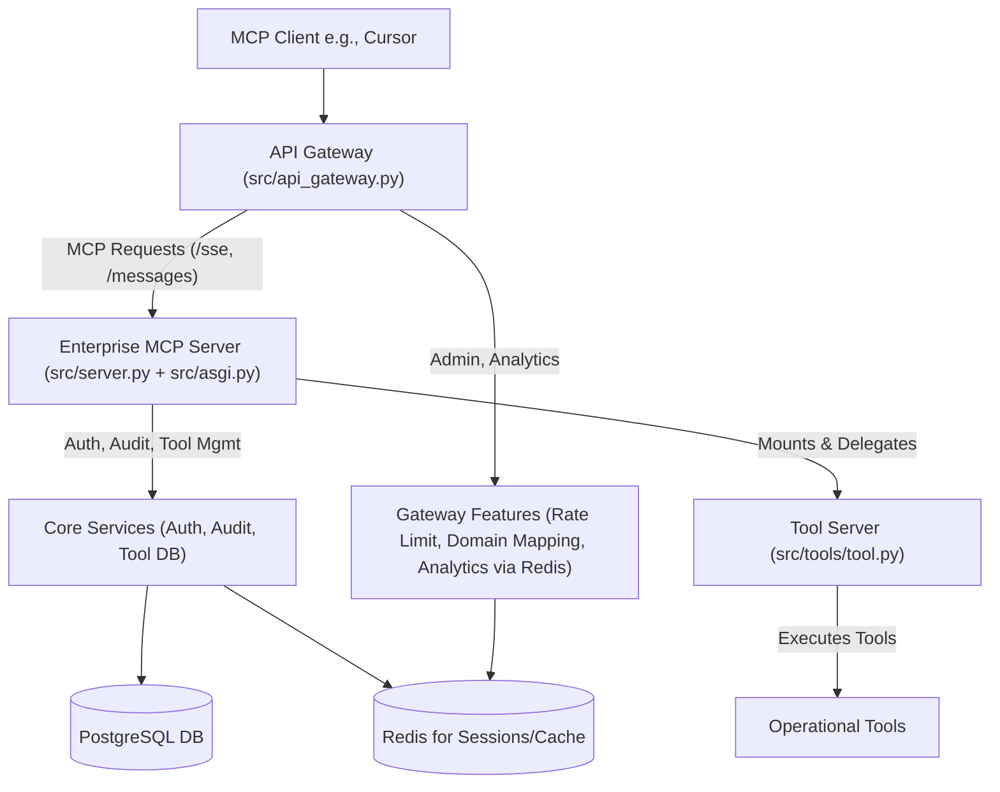

# MCP API Gateway and Services Ecosystem

A comprehensive Model Context Protocol (MCP) solution featuring an API Gateway for routing and management, an Enterprise MCP Server for core services like authentication and tool administration, and a dedicated Tool Server for operational tool execution. Built with FastAPI and FastMCP.

## Overview

This project provides a multi-component system for dynamic registration and execution of tools via the Model Context Protocol (MCP), designed for robust and scalable integration with clients like Cursor.

The core components are:
1.  **API Gateway**: The primary entry point for all client requests. It handles routing to appropriate backend services, rate limiting, analytics, and domain-based configuration.
2.  **Enterprise MCP Server**: A backend service responsible for user authentication, authorization, audit logging, tool definition management (CRUD), and tool versioning. It mounts the Tool Server.
3.  **Tool Server**: A dedicated FastMCP instance where actual operational tools are defined and executed.

This architecture allows for separation of concerns, enhanced security, and better scalability.

## Architecture Diagram



## Features

**API Gateway (`src/api_gateway.py`):**
- **Advanced Routing**: Dynamically routes requests to backend services based on domain and path.
- **Rate Limiting**: Redis-backed rate limiting per domain/client.
- **Request Analytics**: Captures and provides analytics on API usage (via Redis).
- **Domain Mapping Management**: Allows configuration of routing rules, rate limits, and other settings per domain.
- **Backend Health Checks**: Monitors the health of backend services.
- **CORS Handling**: Configurable Cross-Origin Resource Sharing.

**Enterprise MCP Server (`src/server.py`, `src/asgi.py`):**
- **Authentication & Authorization**: Secure token-based authentication (`client_credentials`) and role-based access control.
- **Audit Logging**: Comprehensive logging of significant events and tool interactions to a PostgreSQL database.
- **Tool Definition Management**: API endpoints for creating, reading, updating, and deleting tool definitions in the database.
- **Tool Versioning**: Support for managing different versions of tools.
- **Mounts Tool Server**: Integrates the operational Tool Server.
- **API Compatibility**: Provides MCP-compliant endpoints (`/sse`, `/messages/`) for client interaction, delegating tool execution to the mounted Tool Server.

**Tool Server (`src/tools/tool.py`):**
- **Dedicated Tool Environment**: Isolated FastMCP instance for defining and executing operational tools.
- **Dynamic Tool Registration**: Tools can be added and become immediately available.

**General:**
- **Fully API Compatible**: Designed for seamless integration with MCP clients like Cursor.
- **Dockerized**: Includes Docker and Docker Compose configurations for easy deployment of all components.

## Setup and Installation

### Prerequisites

- Docker and Docker Compose
- Python 3.11+ (for local development)
- An environment file (`.env`) based on `env.example`.

### Environment Setup

1.  **Copy Example Environment File**:
    ```bash
    cp env.example .env
    ```
2.  **Edit `.env`**: Update placeholder values. Key variables include:
    *   `POSTGRES_USER`, `POSTGRES_PASSWORD`, `POSTGRES_DB`, `POSTGRES_HOST`, `POSTGRES_PORT`: For PostgreSQL connection.
    *   `REDIS_URL`: For Redis connection (used by API Gateway and potentially Enterprise Server).
    *   `GATEWAY_PORT`, `GATEWAY_HOST`: For the API Gateway service.
    *   `ENTERPRISE_MCP_PORT` (formerly `PORT` for `src/server.py`): Port for the Enterprise MCP Server.
    *   `ENTERPRISE_MCP_SERVER_URL`: Full URL for the API Gateway to reach the Enterprise MCP Server (e.g., `http://enterprise_mcp_server:<ENTERPRISE_MCP_PORT>`).
    *   `MCP_SERVER_NAME`: Name for the Enterprise MCP Server instance.
    *   `CORS_ALLOWED_ORIGINS`: Comma-separated list of allowed origins for CORS.
    *   `DEFAULT_RATE_LIMIT`: Default rate limit for the API Gateway.
    *   `CLIENT_ID`, `CLIENT_SECRET`: Credentials for MCP client authentication (defined in `.env` and checked by Enterprise MCP Server).
    *   `JWT_SECRET_KEY`, `JWT_ALGORITHM`, `ACCESS_TOKEN_EXPIRE_MINUTES`: For JWT generation by the Enterprise MCP Server.

    Ensure `POSTGRES_USER` and `POSTGRES_PASSWORD` in `.env` match the credentials used by the `postgres` service in `docker-compose.yml`.

### Running with Docker Compose (Recommended)

1.  **Build the Images**:
    ```bash
    docker compose build
    ```
2.  **Start the Services**:
    ```bash
    docker compose up -d
    ```
    This will typically start:
    *   `enterprise_mcp_server` service (which includes the API Gateway logic and mounts the Tool Server).
    *   `postgres` service.
    *   `redis` service.

3.  **Accessing the Services**:
    *   **API Gateway**: `http://<GATEWAY_HOST>:<GATEWAY_PORT>` (e.g., `http://localhost:8000` if `GATEWAY_PORT=8000`). This is the main entry point for clients.
        *   Gateway API Docs (Swagger UI): `http://<GATEWAY_HOST>:<GATEWAY_PORT>/docs`
    *   **Enterprise MCP Server (usually accessed via Gateway)**: `http://<ENTERPRISE_MCP_SERVER_HOST>:<ENTERPRISE_MCP_PORT>` (e.g., `http://localhost:8029`).
        *   Enterprise Server API Docs: `http://<ENTERPRISE_MCP_SERVER_HOST>:<ENTERPRISE_MCP_PORT>/docs`
    *   MCP SSE Endpoint (via Gateway): `http://<GATEWAY_HOST>:<GATEWAY_PORT>/sse`
    *   MCP Messages Endpoint (via Gateway): `http://<GATEWAY_HOST>:<GATEWAY_PORT>/messages/`

4.  **Stopping the Services**:
    ```bash
    docker compose down
    ```

### Local Development (Without Docker)

1.  **Install Dependencies**:
    ```bash
    pip install -r requirements.txt
    # Ensure any other specific requirements files are installed
    pip install uvicorn
    ```
2.  **Set Environment Variables**: Ensure all variables from `.env` are set in your shell. You'll need running PostgreSQL and Redis instances accessible.
3.  **Run the API Gateway**:
    ```bash
    python -m src.api_gateway # Or however it's packaged, e.g., uvicorn src.api_gateway:app --host <GATEWAY_HOST> --port <GATEWAY_PORT>
    ```
4.  **Run the Enterprise MCP Server**:
    ```bash
    python -m src.server # Or uvicorn src.asgi:app --host <ENTERPRISE_MCP_SERVER_HOST> --port <ENTERPRISE_MCP_PORT>
    ```

## Usage

### API Endpoints

Refer to the Swagger UI documentation for each service:
-   **API Gateway Docs**: `http://<GATEWAY_HOST>:<GATEWAY_PORT>/docs`
    -   Includes gateway admin endpoints (`/api/admin/domains`, `/api/admin/analytics/*`) and the main proxy route (`/{path:path}`).
-   **Enterprise MCP Server Docs**: `http://<ENTERPRISE_MCP_SERVER_HOST>:<ENTERPRISE_MCP_PORT>/docs` (if directly accessible, or viewable through its codebase for understanding).
    -   Key endpoints (typically accessed via the Gateway):
        -   `POST /token`: Obtain an authentication token.
        -   `/auth/*`: Authentication and user management.
        -   `/audit/*`: Audit log access.
        -   `/tools/*`: Tool definition management (CRUD).
        -   `/tool-versions/*`: Tool version management.
        -   `/sse`, `/messages/`: Core MCP communication endpoints.

### MCP Client Configuration (e.g., `~/.cursor/mcp.json`)

Configure your MCP client (like Cursor) to connect to the **API Gateway**:

```json
"MCP_API_Gateway": { // Use a descriptive name
    "url": "http://localhost:8000/sse", // Points to API Gateway SSE
    "post_url": "http://localhost:8000/messages/", // Points to API Gateway messages
    "debug": true,
    "retry_timeout_ms": 600,
    "connection_timeout_ms": 6000,
    "blocking_mode": false,
    "stream_mode": true,
    "message_format": "jsonrpc",
    "jsonrpc_version": "2.0",
    "auth": {
        "enabled": true,
        // Token URL points to the Enterprise MCP Server's token endpoint,
        // but the client will send requests through the Gateway.
        // The Gateway needs to be configured to route /token requests appropriately,
        // or the client needs to be aware of the Enterprise Server's direct token URL
        // if the Gateway doesn't proxy /token.
        // Assuming Gateway proxies or client uses direct Enterprise Server URL for token:
        "token_url": "http://localhost:8000/token", // Or direct: "http://localhost:8029/token"
        "grant_type": "client_credentials",
        "client_id": "your_client_id",      // From .env
        "client_secret": "your_client_secret", // From .env
        "content_type": "application/json", // Or "application/x-www-form-urlencoded" if server expects
        "token_property": "access_token",
        "auth_header": "Bearer"
    }
}
```
**Note on Token URL**: The `token_url` should ideally be the API Gateway's path that routes to the Enterprise MCP Server's `/token` endpoint. If the Gateway doesn't explicitly proxy `/token`, the client might need the direct URL to the Enterprise Server's `/token` endpoint (`http://localhost:<ENTERPRISE_MCP_PORT>/token`). The example above uses the Gateway URL, assuming it handles or routes token requests.

### Authentication Flow

1.  The MCP Client requests an access token from the `/token` endpoint (via the API Gateway, which routes to the Enterprise MCP Server).
    -   Uses `client_credentials` grant type with `client_id` and `client_secret` (defined in `.env` and loaded by the Enterprise MCP Server).
2.  The Enterprise MCP Server validates credentials and returns an `access_token`.
3.  The MCP Client includes this `access_token` in the `Authorization: Bearer <token>` header for all subsequent MCP requests (`/sse`, `/messages/`, etc.) to the API Gateway.
4.  The API Gateway forwards the request (with the token) to the Enterprise MCP Server.
5.  The Enterprise MCP Server validates the token before processing the request or delegating to the Tool Server.

## Database Schema

The server uses a PostgreSQL database to store tool definitions, user information, roles, permissions, and audit logs.

See [docs/database_schema.sql](docs/database_schema.sql) for the detailed table structure.

## Contributing

(Add contribution guidelines if applicable)

## License

(Specify project license if applicable)
